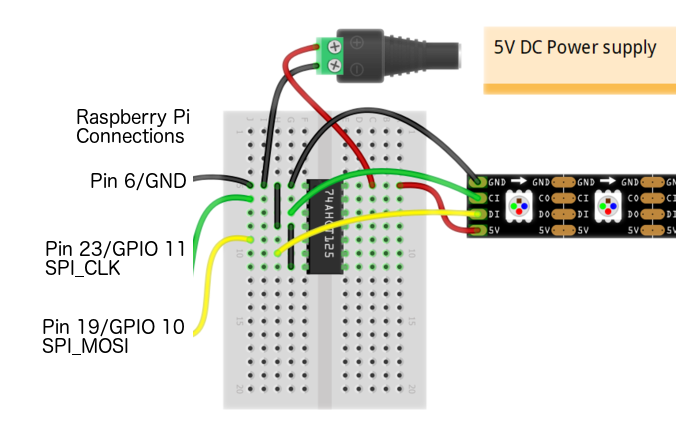

Introduction
============

Copyright © 2018 by Dave Hocker

DotStarAPA102 is a CircuitPython based driver for Adafruit DotStar strings that use the
APA102/APA102C chip. It was inspired by the
`Adafruit_DotStar_Pi <https://github.com/adafruit/Adafruit_DotStar_Pi>`_
package. By basing the driver on CircuitPython we avoid the need for C/C++ code like
that found in the Adafruit_DotStar_Pi package.

**DotStarAPA102 is specifically designed for the Raspberry Pi.**

This driver provides a set of methods and properties that facilitate
manipulating the addressable pixels of a DotStar LED string. The driver
treats the DotStar string as a linear array of pixels where each pixel
is defined by brightness, red, green and blue (BRGB). The first pixel
of the string is pixel 0 while the last pixel of the string is pixel n - 1
(e.g. n = 30 for a 30 pixel string).

The methods facilitate setting individual pixels (set_pixel) or slices of
pixels (fill).

License
=======

Unless otherwise stated, this project is subject to the
`GNU General Public License v3 (GPLv3) <http://www.gnu.org/licenses/gpl.html>`_.

Dependencies
=============

This driver depends on:

* `Adafruit CircuitPython <https://github.com/adafruit/circuitpython>`_
* `SPI Bus Device <https://github.com/adafruit/Adafruit_CircuitPython_BusDevice>`_

Since this package uses SPI for driving the DotStar LEDs, you need to make sure that
SPI is enabled. The easiest way to do this is to use the Raspberry Pi desktop.
Find the Preferences|Raspberry Pi Configuration menu item (start with the
Raspberry icon). Choose the Interfaces tab. Click the Enable button for SPI.
Click OK to finish.

An alternative to the desktop method for enabling SPI is raspi-config. See
https://learn.adafruit.com/adafruits-raspberry-pi-lesson-4-gpio-setup/configuring-spi.

Wiring Diagram
==============

DotStarAPA102 uses the standard SPI interface on the RPi. The following diagram
shows the basic wiring for an RPi. Note that something like a 74AHCT125 buffer chip
is required to do level shifting from 3.3V to 5V. In this case the SPI_CLK
and SPI_MOSI signals are level shifted. See
https://learn.adafruit.com/adafruit-dotstar-leds for more details on DotStars.

This diagram was adapted from https://learn.adafruit.com/assets/63125
and is subject to its `license <https://creativecommons.org/licenses/by-sa/3.0/>`_.

Installing from Source
======================

Here we install the CircuitPython_DotStarAPA102 package into a VENV.

.. code-block:: shell

    workon your-venv-name
    cd ~/CircuitPython_DotStarAPA102
    python setyup.py install

This sequence activates your VEVN, changes into its home directory and runs the
setup.py script.

Usage Examples
==============

Code Snippet
------------

Here is a code snippet that shows all of the basics for driving DotStars.

.. code-block:: shell

    import time
    import board
    import busio
    from adafruit_bus_device import spi_device
    from circuitpython_dotstarapa102.dotstarapa102 import DotStarAPA102

    # Try to create an SPI device for the onboard SPI interface
    # We are using the standard SPI pins
    # SCLK = #23 or GPIO 11 (clock)
    # MOSI = #19 or GPIO 10 (data out)
    # MISO = #21 or GPIO 09 (data in, not used for driving DotStars)

    spi_bus = busio.SPI(board.SCLK, board.MOSI, board.MISO)

    # Wrap the SPI bus in a context manager
    # The baudrate here is believed to be the maximum for an RPi

    spi_dev = spi_device.SPIDevice(spi_bus, baudrate=15000000)

    # Create DotStar driver from the context manager
    # This is a 30 pixel DotStar string
    ds = DotStarAPA102(spi_dev, 30)

    # Set brightness to 1/8th (4 out of 31)
    ds.global_brightness = 4

    # Fill all 30 pixels with red
    ds.fill_rgb(0xFF, 0, 0)

    # Transmit pixels to DotStar string and wait a bit
    ds.show()
    time.sleep(5.0)

    # Clear all pixels (turn off)
    ds.clear()

Test Files
----------

The examples directory contains test files that serve as coding examples. You
can test your install results as follows. This should work even if you have not
wired up a DotStar string.

.. code-block:: shell

    workon your-venv-name
    cd ~/CircuitPython_DotStarAPA102
    python examples/dotstarapa102_test.py

Sphinx documentation
-----------------------

TBD

Sphinx is used to build the documentation based on rST files and comments in the code. First,
install dependencies (feel free to reuse the virtual environment from above):

.. code-block:: shell

    workon your-venv-name
    pip install Sphinx sphinx-rtd-theme

Now, once you have the virtual environment activated:

.. code-block:: shell

    cd docs
    sphinx-build -E -W -b html . _build/html

This will output the documentation to ``docs/_build/html``. Open the index.html in your browser to
view them. It will also (due to -W) error out on any warning. This is a good way to
locally verify it will pass.

Appendices
==========

Building a VENV
---------------
If you aren't very familiar with virtual envionments (venv's), this should help
you get started.

Some useful links:

* https://howchoo.com/g/nwewzjmzmjc/a-guide-to-python-virtual-environments-with-virtualenvwrapper
* https://realpython.com/python-virtual-environments-a-primer/.

Setup virtualenv and virtualenvwrapper
**************************************

The following steps assume that you have installed virtualenv and virtualenvwrapper.
These can be installed system wide as follows.

.. code-block:: shell

    sudo pip3 install virtualenv virtualenvwrapper

Create a directory for your VENVs.

.. code-block:: shell

    mkdir ~/Virtualenvs

Add these lines to the bottom of your ~/.bashrc file.

.. code-block:: shell

    # For virtualenvwrapper
    export WORKON_HOME=~/Virtualenvs
    # this is required to get to the correct version of Python.
    # Otherwise, you will get an error complaining about no virtualenvwrapper module
    export VIRTUALENVWRAPPER_PYTHON=/usr/bin/python3
    source /usr/local/bin/virtualenvwrapper.sh

Create a VENV
*************

Clone the GitHub repo to a location of your choice (~/CircuitPython_DotStarAPA102
in this example).

.. code-block:: shell

    mkvirtualenv -p /usr/bin/python3 your-venv-name
    cd ~/CircuitPython_DotStarAPA102
    pip install -r requirements.txt

You are now ready to install the CircuitPython_DotStarAPA102 package.
